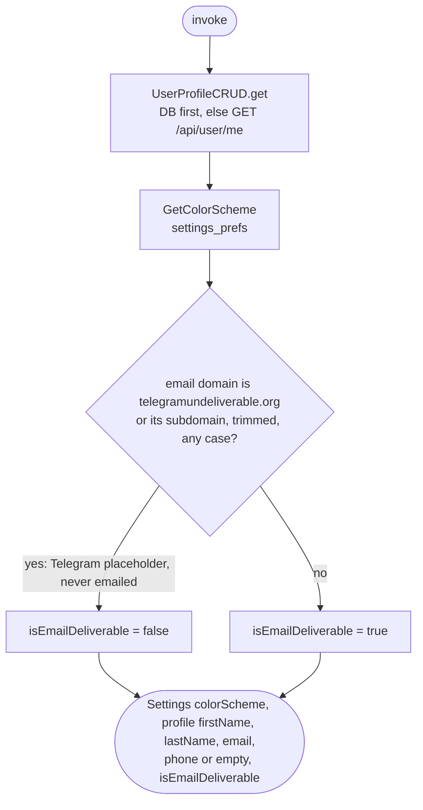

[← Operations](../README.md)

# Get settings

`GetSettings()` → **local-first** · called from `SettingsDashboardViewModel`, `EditProfileViewModel` and `NotificationSettingsViewModel`

```mermaid
flowchart TD
    Start([invoke]) --> P[UserProfileCRUD.get<br/>DB first, else GET /api/user/me]
    P --> C[GetColorScheme<br/>settings_prefs]
    C --> D{email domain is telegramundeliverable.org<br/>or its subdomain, trimmed, any case?}
    D -->|yes: Telegram placeholder, never emailed| U[isEmailDeliverable = false]
    D -->|no| V[isEmailDeliverable = true]
    U --> R([Settings colorScheme, profile firstName, lastName, email,<br/>phone or empty, isEmailDeliverable])
    V --> R
```
